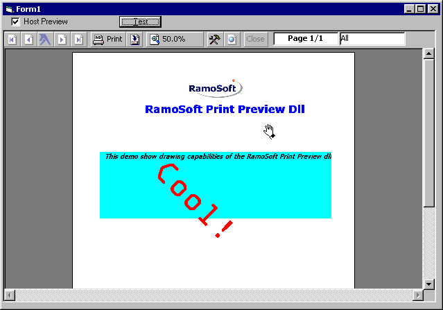



## RamoSoft PrintPreview Dll \(UPDATED\!\!\)

### Description

RamoSoft Print Preview is a production quality component that can be embedded in your own projects to bring print preview capabilities without thrid party controls.

The current capabilities are: multiple Zoom Ratio, Export to several formats (HTML, Text, Csv), Client Window hosting (see screen shoot), cool interface, easy navigation, Printable pages selection. This new update remove some innecesary code and make the component lighter but keepping the export functionallity. Still in a beta fase but is good enought to be used as a base for a production application.

IMPORTANT: Due I have been trying to upload the update without success, please email me to get this new release.

Hey!, don't forget: VOTE FOR ME!!
 
### More Info
 

             |
---                |---
**Submitted On**   |2001-03-01 14:52:38
**By**             |[Leontti A\. Ramos M\.](https://github.com/Planet-Source-Code/PSCIndex/blob/master/ByAuthor/leontti-a-ramos-m.md)
**Level**          |Advanced
**User Rating**    |4.8 (308 globes from 64 users)
**Compatibility**  |VB 5\.0, VB 6\.0
**Category**       |[Complete Applications](https://github.com/Planet-Source-Code/PSCIndex/blob/master/ByCategory/complete-applications__1-27.md)
**World**          |[Visual Basic](https://github.com/Planet-Source-Code/PSCIndex/blob/master/ByWorld/visual-basic.md)
**Archive File**   |[CODE\_UPLOAD15666312001\.zip](https://github.com/Planet-Source-Code/leontti-a-ramos-m-ramosoft-printpreview-dll-updated__1-21431/archive/master.zip)

